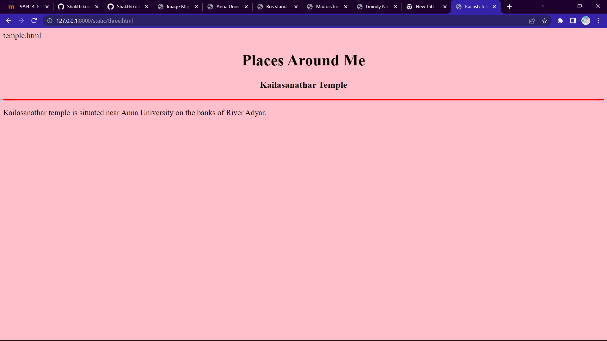

https://github.com/Shakthikumar22009242/NearMe.git# Ex04 Places Around Me
## AIM
To develop a website to display details about the places around my house.

## DESIGN STEPS

### STEP 1
Create a Django admin interface.

### STEP 2
Download your city map from Google.

### STEP 3
Using <map> tag name the map.

### STEP 4
Create clickable regions in the image using <area> tag.

### STEP 5
Write HTML programs for all the regions identified.

### STEP 6
Execute the programs and publish them.

## CODE

```
html
map.html
<html>
<head>
<title> Image Map </title>
</head>
<body>
<h1 align="center">
<font color="red"><b>Anna University</b></font>
</h1>
<h3 align="center">
<font color="blue"><b>Places Around Me</b></font>
</h3>
<center>

<map name="MyCity">
</center>
</body>
</html> 


annauniv.html
<html>
<head>
<title>Anna University</title>
</head>
<body bgcolor="white">
<h1 align="center">Places Around Me</h1>
<h3 align="center">Anna University</h3>
<hr size="3" color="red">
<p align="justify">
Excellent University for doing Engineering Courses
</p>
</body>
</html>

bs.html
<html>
<head>
<title>Bus stand</title>
</head>
<body bgcolor="orange">
<h1 align="center">Places Around Me</h1>
<h3 align="center">Bus Stand</h3>
<hr size="3" color="red">
<p align="justify">
A well-equipped bus stop where all the MTC buses and share autos will stop.
</p>
</body></html>


temple.html
<html>
<head>
<title>Kailash Temple</title>
</head>
<body bgcolor="pink">
<h1 align="center">Places Around Me</h1>
<h3 align="center">Kailasanathar Temple</h3>
<hr size="3" color="red">
<p align="justify">
Kailasanathar temple is situated near Anna University on the banks of River Adyar.
</p>
</body>
</html>


mit.html
<html>
<head>
<title>Madras Institute of Technology</title>
</head>
<body bgcolor="yellow">
<h1 align="center">Places Around Me</h1>
<h3 align="center">Madras Institute of Technology</h3>
<hr size="3" color="red">
<p align="justify">
Best place for studying UG and PG courses.
</p>
</body>
</html>


park.html
<html>
<head>
<title>Guindy National Park</title>
</head>
<body bgcolor="cyan">
<h1 align="center">Places Around Me</h1>
<h3 align="center">Guindy National Park</h3>
<hr size="3" color="red">
<p align="justify">
Nice Park.
</p>
</body>
</html>
```


## OUTPUT




## RESULT
The program for implementing image maps using HTML is executed successfully.